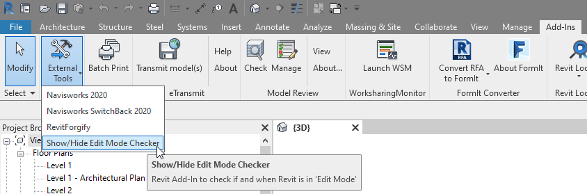
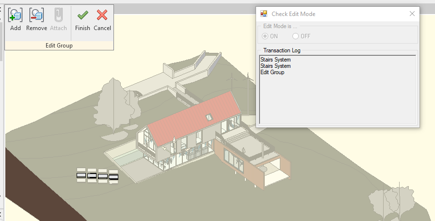
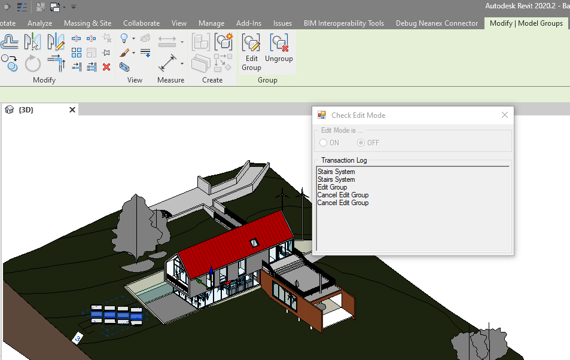
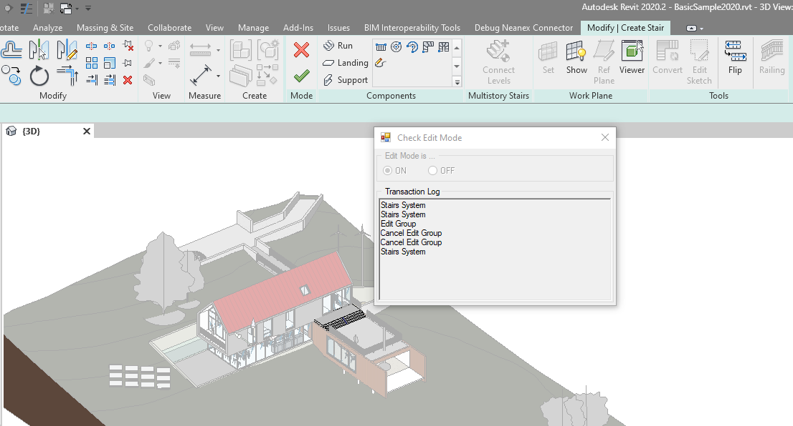
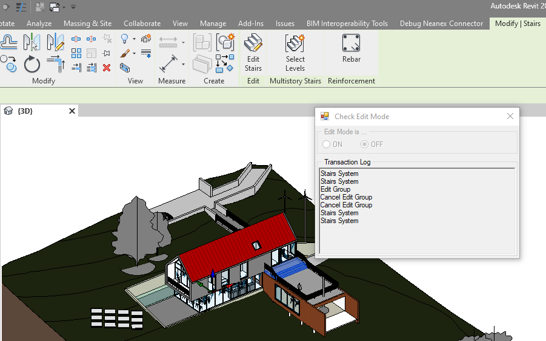
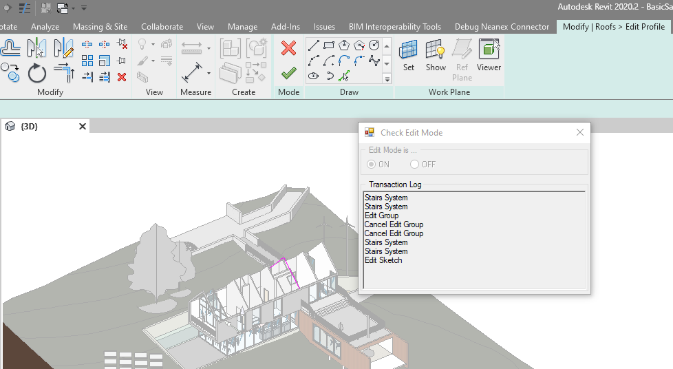
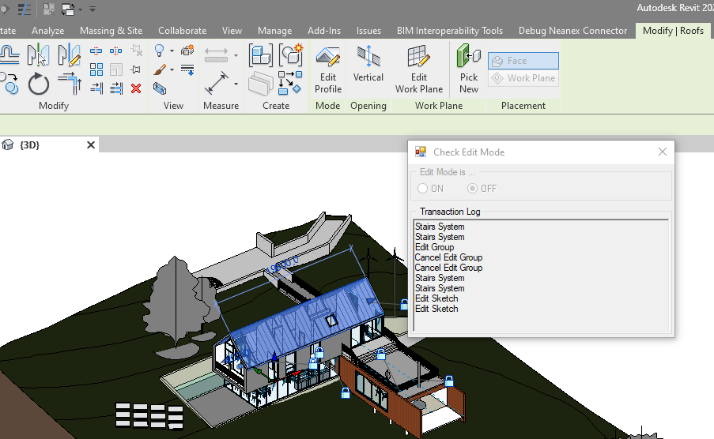

# TestEditModeChecker

&nbsp;&nbsp;

&nbsp;&nbsp;

&nbsp;&nbsp;

&nbsp;&nbsp;

## C# Revit add-in to test if Revit is in Edit Mode.
This Revit add-in shows one technique how to detect if Revit is in some kind of 'Edit Mode'.
This work was inspired by the reply of Ahmed Nabil in the Revit API forums: 
https://forums.autodesk.com/t5/revit-api-forum/group-edit-event/m-p/9232010/highlight/true#M43668

It works not only for detecting 'Edit Group' mode, but all kinds of edit modes (Edit Assembly, Edit Profile, Edit Stairs, etc...). 
The technique uses the Revit transaction names to see if a transaction has been started, cancelled or finished.

The add-on might not yet detect all kinds of edit modes. 
The author hasn't tested all kinds of edit modes, 
but the list with transactions to detect edit modes can easily be extended, 
see [constructor of class EditModeChecker](TestEditModeChecker/EditModeChecker.cs#L6).

Also, this has only been tested with English language versions of Revit. 
The transaction names probably need translating for non-English versions.

## Use Case
Executing Revit API actions from a non-modal (modeless) dialogue, using External Events (> IExternalEventHandler), 
can produce unexpected results when Revit is in some kind of edit mode.

When starting an action from a non-modal dialogue, the action gets queued and only executed ones Revit is ready to execute the action.
When Revit is in some kind of 'edit mode' this can be some time after the action was queued, 
and the context might have changed significantly, which can render the input invalid.

In that case you might want to stop the user from executing the action in the first place.

## References
* https://forums.autodesk.com/t5/revit-api-forum/group-edit-event/m-p/9232010/highlight/true#M43668
* https://forums.autodesk.com/t5/revit-api-forum/detecting-modify-mode-aka-edit-mode/m-p/5616006
* https://thebuildingcoder.typepad.com/files/external_events_knowledgebase.html

## Sreenshots
Start the "Edit Mode Checker" addin:

"Edit Group" mode detected:

"Edit Group" mode cancelled:

"Edit Stairs" mode detected:

"Edit Stairs" mode cancelled:

"Edit Profile" mode detected:

"Edit Profile" mode cancelled:

## Author
Wolfgang Weh,
[Neanex](https://www.neanex.com)

## License
This sample is licensed under the terms of the [MIT License](http://opensource.org/licenses/MIT).
